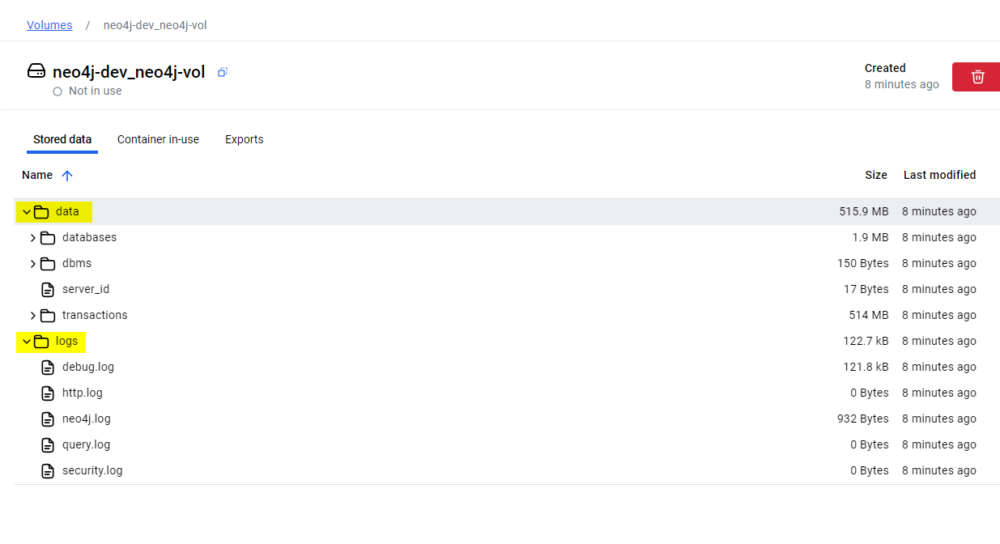

# Neo4j Developer Template
This is a neo4j development template with the pre-configured sample CSV files mapped to import section for `LOAD CSV`. 

A sample python script to programatically connect to neo4j instance and create a sample graph from the cypher query file. 

This setup comes with the `apoc` & `graph-data-science` plugin configured for the setup.

## Docker multiple folder on same volume

There has been few insitances where I didnt wanted to create multiple volumes/bind mounts, instead I wanted to have multiple folders within the same volume mapped to various locations of the target container. 

This setup illustrates the same with the help of following refrences:

[Github - Single Volume - Multiple folder mount](https://github.com/moby/moby/issues/47842)

[Docker - Single Volume - Multiple folder mount](https://forums.docker.com/t/volume-subpath-in-docker-compose/143463/5)

The above folders are mapped respectivly in the running container

## Neo4J Configuration and Cypher Refrences

[Getting started with Neo4j in Docker](https://neo4j.com/docs/operations-manual/current/docker/introduction/)

[Cypher Cheat Sheet](https://neo4j.com/docs/cypher-cheat-sheet/5/all/)

[LOAD CSV](https://neo4j.com/docs/cypher-manual/current/clauses/load-csv/)

[Query Neo4J](https://neo4j.com/docs/cypher-manual/current/clauses/)

[Configure the APOC extension - Docker](https://neo4j.com/docs/apoc/current/installation/#docker)

[Configure the GDS extension - Docker](https://neo4j.com/docs/graph-data-science/current/algorithms/)

## Setup Python virtual environment for Neo4J script automation and query

`python -m venv .grph`

`.\.grph\Scripts\activate.ps1`

`pip install -r .\requirements.txt`

`python.exe -m pip install --upgrade pip`